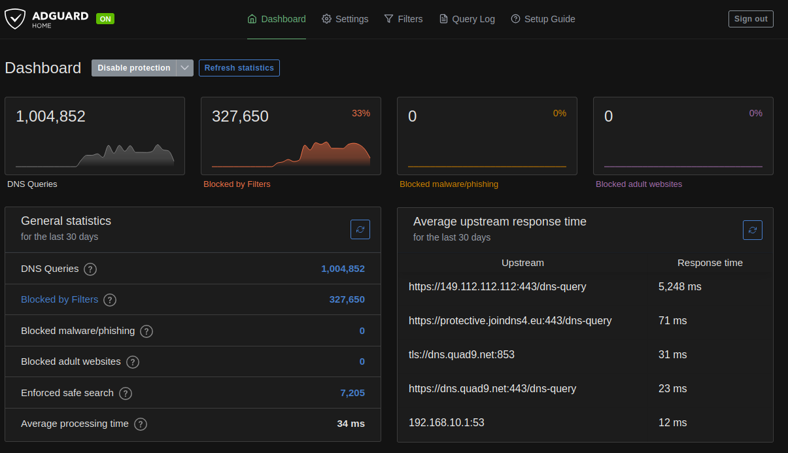
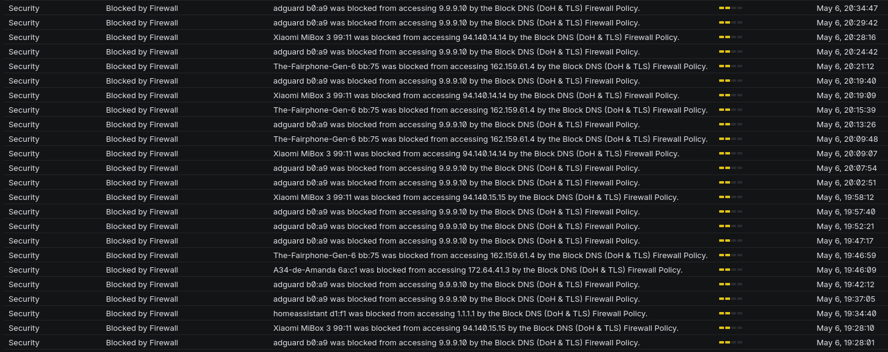
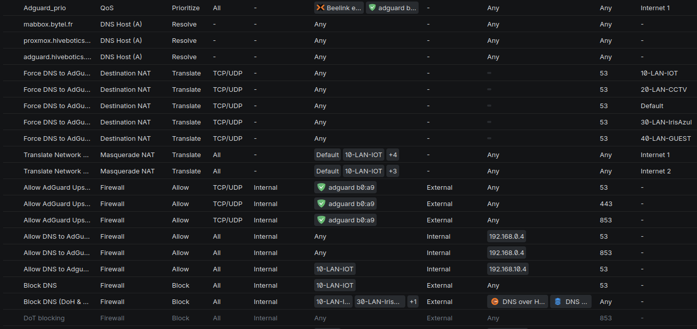

As a European citizen, online privacy matters to me. For years, I relied on US-based DNS providers such as Cloudflare and Google for my home network. Recently, I decided it was time to move away from them.

What started as a simple DNS change quickly turned into a much larger project involving AdGuard Home, Tailscale, UniFi firewall rules, DNS-over-HTTPS, DNS-over-TLS, and a surprising number of devices trying to bypass my local resolver.

Here are some lessons learned along the way and it isn't about setting ads filtering on AdGuard.

One piece of advice before we begin: never experiment with DNS remotely while your spouse is working from home.

<!-- more -->

## The Initial Setup

My initial setup was fairly straightforward:

For several years, I have been using [Cloudflare's 1.1.1.1](https://one.one.one.one/) as my primary DNS provider after moving away from [Google's 8.8.8.8](https://developers.google.com/speed/public-dns/docs/using). I also configured AdGuard DNS as a backup.

At home, I run a [UniFi network](https://www.ui.com/) with [AdGuard Home](https://adguard.com/fr/adguard-home/overview.html) inside a VM. AdGuard Home acts as both an ad blocker and a DNS resolver for the entire network.

For remote access, I use [Tailscale](https://tailscale.com/) with the AdGuard server configured as an exit node. This allows me to benefit from the same filtering whether I am at home or travelling.

Neither AdGuard Home nor UniFi are Open Source, but sometimes I simply want something that works without spending an entire weekend debugging every update.

Overall, this setup worked quite well. It bypassed my ISP's DNS servers, blocked a fair amount of tracking and advertising, and generally stayed out of my way.

It also helped with some websites that French ISPs occasionally make harder to reach, such as Linux ISO torrent sites and scientific repositories like Sci-Hub.

## Why Change?

As the political and legal landscape around data sovereignty continues to evolve, I wanted to reduce my dependence on US-based infrastructure whenever practical.

After some research, I settled on two alternatives:

- [Quad9](https://quad9.net/)
- [DNS4EU](https://joindns4.eu/)

Quad9 is a Swiss-based non-profit DNS service focused on privacy and security. While Switzerland is not part of the European Union, it still offers strong privacy protections and remains a compelling alternative.

DNS4EU is a newer initiative supported by the European Union, aiming to provide European DNS infrastructure.

My first thought was simple:

> Replace Cloudflare with Quad9 and DNS4EU in AdGuard Home and call it a day.

Technically, it worked.

In practice, it exposed several problems in my DNS architecture.

## The First Surprise

After switching upstream DNS providers, I noticed something strange.

AdGuard Home was not showing requests from several devices:

- Firefox on my laptop
- Home Assistant
- My robot vacuum
- Various IoT devices

Even worse, requests coming through Tailscale appeared as if they all originated from the server itself.

Clearly, some devices were bypassing my DNS configuration.

## Understanding the Problem

My architecture looked like this:

```text
+--------+
| Device |
+--------+
     |
     v
+------------+
| UniFi DHCP |
+------------+
     |
     v
+--------------+
| AdGuard Home |
+--------------+
     |
     v
+---------------+
| Quad9 / DNS4EU|
+---------------+
```

At least, that was the theory.

UniFi distributes AdGuard Home as the DNS server through DHCP, so every device should use it.

The reality is different.

Many devices implement their own DNS logic:

Firefox can enable DNS-over-HTTPS directly.
Android devices may use Private DNS.
IoT devices often hardcode their own DNS servers.
Applications can completely ignore the DNS server provided by DHCP.

As a result, traffic was bypassing AdGuard entirely. And I didn't like it.

## Configuring AdGuard Home Properly

My first step was improving the AdGuard Home configuration.

I switched the upstream servers to encrypted DNS endpoints:

```` text
https://dns.quad9.net/dns-query
tls://dns.quad9.net
https://protective.joindns4.eu/dns-query

[/local/]192.168.0.1:53
[/localdomain/]192.168.0.1:53
[/iot/]192.168.0.1:53
[/cctv/]192.168.0.1:53

[/0.168.192.in-addr.arpa/]192.168.0.1
[/10.168.192.in-addr.arpa/]192.168.10.1 192.168.0.1
[/20.168.192.in-addr.arpa/]192.168.20.1 192.168.0.1
[/30.168.192.in-addr.arpa/]192.168.30.1 192.168.0.1
[/40.168.192.in-addr.arpa/]192.168.40.1 192.168.0.1

[/100.in-addr.arpa/]100.100.100.100
[/in-addr.arpa/]192.168.0.1
[/ip6.arpa/]192.168.0.1
````

The first entries are straightforward:

```` text
https://dns.quad9.net/dns-query          <--- Quad9 DNS using HTTPS
tls://dns.quad9.net                      <--- Quad9 DNS with tls explicitly
https://protective.joindns4.eu/dns-query <--- dns4eu DNS using HTTPS
````

These use encrypted DNS transports:

- DNS-over-HTTPS (DoH)
- DNS-over-TLS (DoT)

Traditional DNS on port 53 is unencrypted. While encrypted DNS does not make your browsing invisible, it does prevent passive observation of DNS queries along the network path.

The rest of the configuration handles local name resolution and reverse lookups.

This allows AdGuard Home to associate requests with actual device names instead of only displaying IP addresses.

For example:

`192.168.0.42`

becomes:

`MyLaptop.localdomain`

which makes logs much easier to read.

You may also notice that my network is split into multiple VLANs:

- localdomain
- iot
- cctv

IoT devices live in their own isolated network. CCTV equipment is separated as well, with dedicated routing and QoS policies.

### Backup Servers and Bootstrap DNS

One challenge with encrypted DNS is that you need DNS working before you can resolve hostnames such as:

`dns.quad9.net`

To avoid a chicken-and-egg problem, I configured backup resolvers:

```` text
https://149.112.112.112/dns-query
tls://protective.joindns4.eu
86.54.11.201
2a13:1001::86:54:11:201
````

AdGuard Home also supports Bootstrap DNS servers:

```` text
https://149.112.112.112/dns-query
9.9.9.9:853
149.112.112.112:853
86.54.11.1:853
194.242.2.2:853
````

These are used only to resolve the encrypted DNS providers themselves.

Notice the use of port 853, the standard port for DNS-over-TLS.

### Private Reverse DNS

For local hostname resolution, I also configured Private Reverse DNS servers:

```` text
192.168.0.1
192.168.10.1
192.168.20.1
192.168.30.1
192.168.40.1
100.100.100.100:53
[/0.168.192.in-addr.arpa/]192.168.0.1
[/10.168.192.in-addr.arpa/]192.168.10.1 192.168.0.1
[/20.168.192.in-addr.arpa/]192.168.20.1 192.168.0.1
[/30.168.192.in-addr.arpa/]192.168.30.1 192.168.0.1
[/40.168.192.in-addr.arpa/]192.168.40.1 192.168.0.1
[/in-addr.arpa/]192.168.0.1
[/ip6.arpa/]192.168.0.1
````

This completes the AdGuard Home configuration.

Or so I thought.

## The Firewall Strikes Back

Even with AdGuard properly configured, some devices were still bypassing it.

The solution was enforcing DNS at the network level.

Since my entire network is behind a UniFi gateway, I can intercept DNS traffic using firewall and NAT rules.



We can see from the log that some phones and HomeAssistant are still trying to make direct DNS requests !
And that I blocked AdGuard itself from doing DNS requests ... What a Noob ...

Here are my new firewall rules :


### DNAT

I created DNAT rules that redirect all outbound DNS traffic on port 53 to AdGuard Home.

As a result:

> Device → 8.8.8.8:53

becomes:

> Device → AdGuard Home:53

without the device noticing.

This forces most devices to use my local resolver.

To preserve network isolation, I added an additional interface to the AdGuard VM inside the IoT VLAN rather than opening broad inter-VLAN access.

An added benefit is that AdGuard now sees requests from the real devices rather than from the gateway itself.

### Fighting DNS-over-HTTPS

The final challenge was DNS-over-HTTPS and DNS-over-TLS.

These protocols allow devices to bypass local DNS entirely.

The solution was simple:

- Block outbound DoH and DoT traffic.
- Create exceptions for AdGuard Home itself.(Or get call from your spouse that internet is broken again)

This forces clients back to traditional DNS, which is immediately redirected to AdGuard and then re-encrypted upstream toward Quad9 and DNS4EU.

This approach keeps control of DNS inside my network while still benefiting from encrypted upstream queries.

It also dramatically improves visibility and logging

### Tailscale

My final change was moving Tailscale directly onto the AdGuard VM.

Previously, all remote traffic appeared to originate from the exit node.

By running Tailscale on the DNS server itself, AdGuard can now see the actual client devices making requests.

The logs are cleaner, troubleshooting is easier, and the whole setup behaves much more predictably

## Conclusion

What started as a simple switch away from Cloudflare turned into a full audit of my DNS architecture, we a lot of non helping help from LLMs.

The good news is that most DNS traffic is now routed through AdGuard Home and forwarded to European or privacy-focused DNS providers using encrypted transports.

The bad news is that modern devices are increasingly determined to ignore your network configuration.

The upside is that, with a few firewall rules and some patience, you can still take back control without beeing an expert in networking.

I go from around 22% request blocked to 33% with correct logging.

Average upstream response time get from 10ms to 33ms on average.

But yes, my online privacy is absolutely worth an extra 20 milliseconds.
