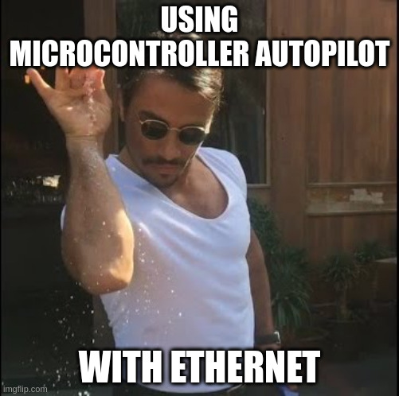

<!-- https://imgflip.com/i/9wjg9n -->

At ArduPilot, we're passionate about bringing advanced mobile robotics to the masses.
Over the years, we have made significant success in enabling safe flight, autonomous navigation, and user-friendly operations—all while adhering to local regulations, of course!

## Ethernet on Microcontrollers? Yes, Really!

<!-- https://imgflip.com/i/9wjgea  -->

Last year, we extended our autopilot lineup to include Ethernet and networking capabilities. That’s right—IP-based connections on microcontrollers! This opens up exciting new possibilities for integrating peripherals, simplifying computer connectivity, and expanding into the realms of IoT and IoR (Internet of Robots).
Check out the details on our Wiki:
👉 [Ethernet and Networking with ArduPilot](https://ardupilot.org/plane/docs/common-network.html)

## Taking It Further with Lua and LTE

But we’re not stopping there. You already know that ArduPilot supports powerful [Lua scripting](https://ardupilot.org/dev/docs/common-lua-scripts.html). Now, we’ve taken that a step further: you can directly interface certain LTE modems using Lua, issuing AT commands to establish a data link.

See our GitHub documentation here:
📄 [LTE Modem Driver via Lua](https://github.com/ArduPilot/ardupilot/blob/master/libraries/AP_Scripting/drivers/LTE_modem.md)

Pretty cool, right? This opens the door to **theoretical unlimited-range communication** in many areas—ideal for sending MAVLink messages over the cellular network. Nothing revolutionary either but easier access for all !

## Some Words of Caution
Of course, there are caveats:

* **Performance**: These modems aren’t stellar when it comes to signal strength or bandwidth.
* **Data** Limits: Communication is via AT commands—great for MAVLink, but don’t expect to stream video or send images.
* **Latency**: You won't have control over network latency. This makes LTE connections suitable for ground vehicles or non-critical mission updates, not for FPV or latency-sensitive control.

!!! warning

    ⚠️ **Important**: Many countries restrict or prohibit LTE-based drone control. Always check your local regulations before flying with cellular links!

## Future
These enhancements pave the way for new ArduPilot applications, and we’re excited to see how the community puts them to use. If you have a cool demo using these LTE modems, share it—we’d love to see it in action!

<!-- https://imgflip.com/i/9wjggw -->
