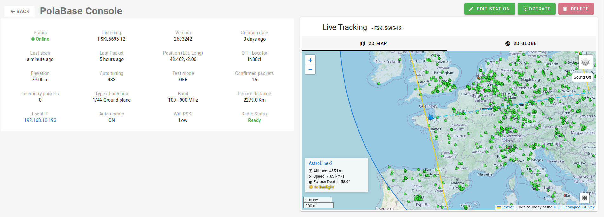
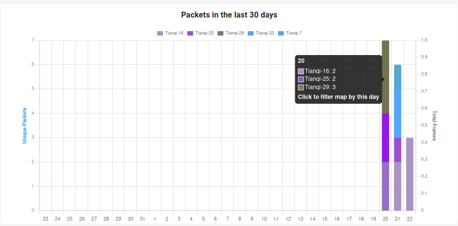

Back in 2020, I bought a few cheap ESP32 boards to experiment with Drone Remote ID [Open Source French Drone Identification](fr_remoteid.md). It turns out these boards also include an SX1278 LoRa module at 433 MHz.

Here is the board:
[TTGO T-BEAM](https://lilygo.cc/products/t-beam?variant=43059202654389)

At the time, Meshtastic wasn't really a thing yet. LoRa at 433 MHz doesn't have particularly long-range, and I didn't have a clear use case anyway…

But then I discovered something much more interesting: [TinyGS](https://tinygs.com/).

TinyGS is an open network of ground stations distributed around the world, designed to receive telemetry from LoRa satellites, weather probes, and other flying objects using cheap and versatile hardware. And of course, the project is FOSS, so I had to give it a try !

I even opened a PR back then:
[Github PR100](https://github.com/tinygs/tinyGS/pull/100) (still open, unfortunately…)

At that time, I was living in the middle of a large city, and I never managed to receive anything, not with the default antenna, nor with a cheap "5 dBi" advertised one.

<!-- more -->

Last weekend, while digging through my "projects to finish" box, I found those boards again. Since I'm now living in the countryside, I decided to give TinyGS another shot.

I couldn't find the proper antenna, the 5 dBi one is used for my solar panels telemetry (that's another story involving OpenDTU…). So I improvised and plugged in an old antenna from a drone SiK radio.

After 3 days of deep space silence ...

I finally received some CubeSat telemetry.

Honestly, I'm still surprised I managed to receive anything with such a questionable setup. Who said 433 MHz had poor range? I recorded a transmission from 2,279 km away, with the satellite at an altitude of 895 km. Not bad at all.

Here is my station dashboard : 

[TinyGS PolaBase](https://tinygs.com/station/PolaBase@kjREUdMjMTPjaJDL)

I'll write a more detailed setup guide once I get a proper antenna.
