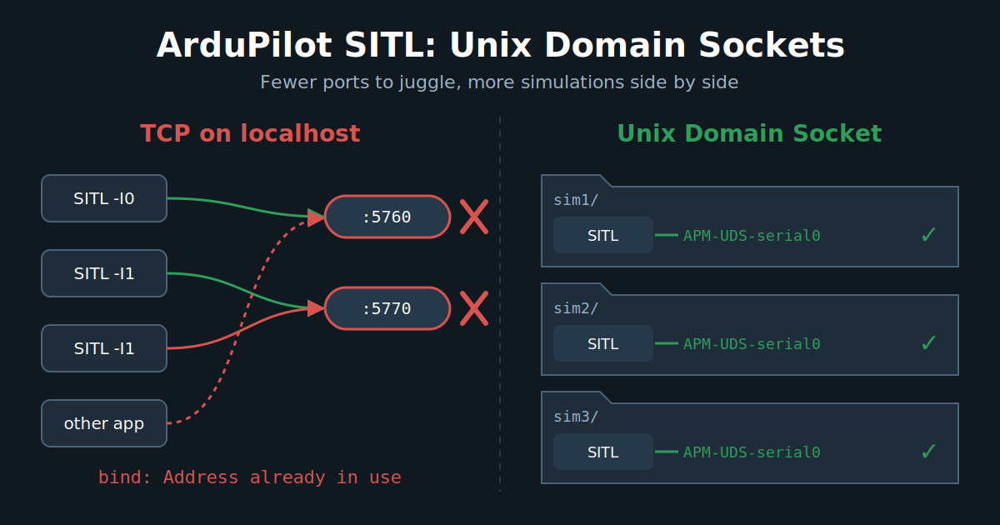

ArduPilot simulation is simple and complex at the same time, since we support a lot of features.
We obviously allow testing all the vehicle types we support, but what is less known is that we can simulate different sensors, such as GNSS, compass or eAHRS, with their real protocol AND their physical bus: SPI, I2C, UART, CAN. That's right, we have a virtual CAN bus, but also I2C and SPI simulation!
That is quite convenient for developers, but less useful for most users.
Running one SITL is easy. Running dozens of SITLs is where TCP ports start becoming annoying, as we need to manage the ports numbering, collisions and we start seeing congestion and TCP/UDP limits !

Recently, we integrated support for a new way to communicate with the simulation instance: UDS (Unix Domain Socket) !

<!-- more -->

Let's see what all this is about!

## Unix Domain Socket

### What is a UDS?

A Unix Domain Socket (UDS, or `AF_UNIX`) is an inter-process communication endpoint that lives on the filesystem instead of on a network interface. From the program's point of view, it is the same socket API as TCP or UDP: `socket()`, `bind()`, `listen()`, `accept()`, `send()`, `recv()`. The difference is the address: instead of `127.0.0.1:5760`, you get a file path like `./APM-UDS-serial0`.

Like the IP world, there are two main flavours:

- `SOCK_STREAM`: a connected byte stream, the equivalent of TCP. ArduPilot uses it for the serial ports.
- `SOCK_DGRAM`: message-based, roughly equivalent to UDP. Unlike UDP, Unix datagram sockets is ordered, no silent packet loss under load, which is useful for the simulated RC input.

### Why it can be better than TCP on localhost for ArduPilot ?

When SITL and MAVProxy talk over `tcp:127.0.0.1:5760`, the data still goes through the whole TCP/IP stack, even if it never leaves the machine: segmentation, checksums, ACKs, congestion control, Nagle (that's why SITL sets `TCP_NODELAY`), routing on the loopback interface... A UDS avoids the IP networking stack and most of its associated processing, providing a simpler path for passing data between the two processes (simplified). This can also be translated as less latency and less CPU per message. For a single SITL, that's nice but not life changing. For swarming or large ROS-based deployments, this starts becoming more interesting: SITL traffic no longer has to go through the TCP/IP stack, which can reduce the amount of networking overhead and avoid adding more traffic to an already busy network stack.

But the real gain for us is elsewhere: **no more port allocation**.

With TCP, every SITL instance needs its own set of ports. That's why we have the `-I` instance option that shifts everything by 10 (`5760`, `5770`, `5780`...) and the `5501 + 10 * i` RC input port. As soon as you run several simulations in parallel (autotest on a big CI machine, multiple developers on the same server, several git worktrees, a swarm...), you have to carefully manage the instance numbers, or they fight for the same ports. And some other software on your machine may also want port 5760!

With UDS, the endpoint is a file in the SITL working directory. Two SITL instances in two different directories can't collide, whatever their instance number. You also get some extras for free:

- Access is controlled by filesystem permissions, and the socket is never reachable from the network.
- In Docker, you share the socket by bind mounting the directory, no port publishing needed.

Of course, there are some limits:

- It is local only. A GCS on another machine can't connect directly.
- The path length is limited to about 108 characters (`sun_path`), so avoid deep working directories.
- If a program crashes, the socket file stays on disk. ArduPilot handles this: on `bind()` failure it probes the existing socket, and only if nobody is listening on it (and it is still the same file) it removes it and binds again. An active SITL is never stolen.
- Most GCS (Mission Planner, QGroundControl) don't speak UDS. MAVProxy and Pymavlink got support for it.

So UDS provides a local alternative to the TCP-backed transport, but won't be a full replacement.

### How to use it

This was added by [ArduPilot PR #34129](https://github.com/ArduPilot/ardupilot/pull/34129), with the matching support in [pymavlink](https://github.com/ArduPilot/pymavlink/pull/1264) and [MAVProxy](https://github.com/ArduPilot/MAVProxy/pull/1735).

The simplest way is with `sim_vehicle.py`:

```bash
Tools/autotest/sim_vehicle.py -v ArduCopter --uds
```

`--uds` (or its long form `--unix-domain-socket`) switch all the TCP backed serial ports by sockets in the working directory:

```text
APM-UDS-serial0   <- SERIAL0, SITL waits for a client on it, like tcp:0:wait
APM-UDS-serial1
APM-UDS-serial2
APM-UDS-serial5 ... APM-UDS-serial8
APM-UDS-rcin      <- RC input, datagram socket
```

MAVProxy is started automatically with the right endpoints, something like:

```bash
mavproxy.py --master uds:$PWD/APM-UDS-serial0 --sitl uds:$PWD/APM-UDS-rcin
```

As each instance uses its own working directory, running many simulations in parallel is just a matter of running them in different directories. `--uds` can't be mixed with `--udp` or `--mcast`.

You can also configure it by hand on the SITL binary (yep, SITL isn't sim_vehicle.py! 😉), with the new `uds:` serial device type, next to the usual `tcp:`, `udpclient:`, `uart:`...:

```bash
build/sitl/bin/arducopter --model quad \
    --serial0=uds:APM-UDS-serial0:wait \
    --serial1=uds:APM-UDS-serial1 \
    --rc-in-port=uds:APM-UDS-rcin
```

From a Python script, pymavlink understands the same `uds:` prefix:

```python
from pymavlink import mavutil

master = mavutil.mavlink_connection("uds:APM-UDS-serial0")
master.wait_heartbeat()
print("Heartbeat from system %u" % master.target_system)
```

And autotest gets the same option, so the CI can run tests in parallel without port juggling:

```bash
Tools/autotest/autotest.py --unix-domain-socket test.Copter.InitialMode
```

### ArduPilot Linux

UDS support currently targets SITL. BUTTTTTTTTTTTT, the underlying socket support lives in ArduPilot's common socket library. That means the same infrastructure can be reused by the Linux HAL and Linux peripherals in the future.

## Conclusion

UDS is not here to replace TCP or UDP. It is another tool in the SITL toolbox, specifically useful when running multiple local simulations in parallel.

No more port juggling, easier isolation between SITL instances, and potentially less networking overhead. And since the underlying socket support is already shared with the Linux code, there is more to come.

Give it a try and report what breaks!
